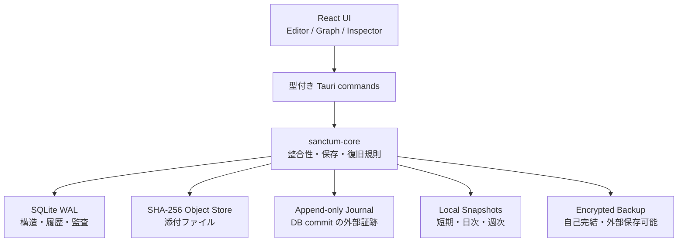
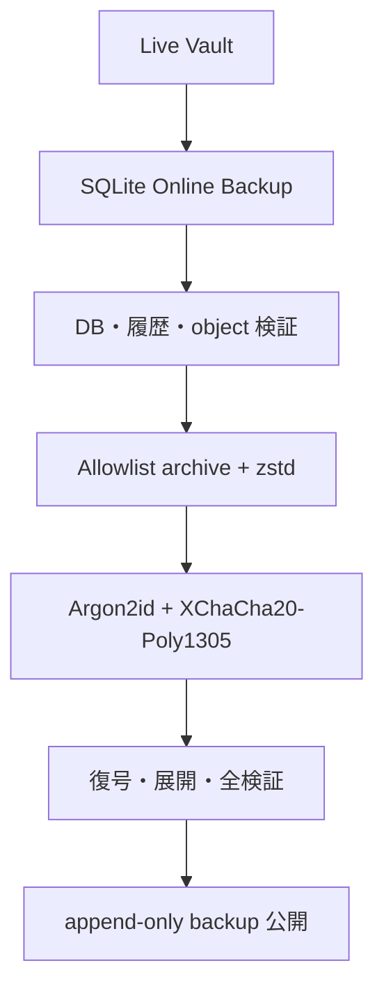
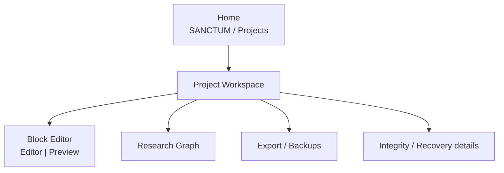

# Sanctum Phase 1 設計

> 「ファイルを保存する」のではなく、「研究の思考構造を、検証可能な履歴として永続化する」。

この文書は実装前の設計判断を固定する。Phase 1 のアプリ名は **Sanctum**、各研究プロジェクトも独立した **Sanctum Vault** と呼ぶ。

## 1. 全体 Architecture



信頼境界は Rust core に置く。React は Vault のファイルや SQLite に直接触れず、すべての変更を型付きコマンド経由で依頼する。WebView が停止しても、Rust が返した「成功」は SQLite transaction が commit され、回復用 journal outbox が残った後に限る。

### 不変条件

1. Block の保存は、現在状態・不変 version・Vault revision・change event・journal outbox を一つの transaction で commit する。
2. 過去 version の復元は過去行を書き換えず、新しい version を追加する。
3. 添付ファイルは staging へコピーし、fsync と SHA-256 再計算を終えてから DB relation を作る。
4. content-addressed object は Phase 1 では物理削除しない。
5. Snapshot は DB の `quick_check` / `foreign_key_check`、研究履歴、DB hash、参照 object を検証後にのみ公開する。
6. Backup は暗号化ファイルを実際に読み戻し、認証・展開・DB・object を検証してから成功とする。
7. Restore は常に新しい clone 先へ行い、既存 Vault を上書きしない。
8. Sync と Backup は別機能・別保持期間とし、Phase 1 に Sync は入れない。
9. migration は連番・checksum 付き・transactional とし、既存 Vault の migration 前には snapshot を要求する。
10. delete は soft delete。物理削除を通常 API と UI から提供しない。
11. Vault、Snapshot、Backup、Restore clone の公開は atomic no-replace とし、同名pathを決して上書きしない。

## 2. Directory Structure

### Source tree

```text
sanctum/
├── crates/sanctum-core/       # UI 非依存の保存・復旧エンジン
│   ├── migrations/            # checksum 付き SQL migration
│   ├── src/domain/            # 永続化モデル
│   └── tests/                 # crash/restore/integrity tests
├── src-tauri/                 # 薄い Tauri adapter と capability
├── src/                       # React UI
├── docs/                      # 設計、安全性、復旧 runbook
└── scripts/                   # 検証補助
```

### Vault tree

```text
Project.sanctum/
├── manifest.json
├── db/
│   └── sanctum.sqlite
├── objects/
│   └── sha256/ab/cd/<64-char-hash>
├── journal/
│   └── 00000000000000000001.json
├── snapshots/
│   └── <timestamp>-r<revision>/
│       ├── manifest.json
│       └── sanctum.sqlite.zst
├── staging/
├── quarantine/
├── settings/
│   └── automatic-backup/      # append-only設定。passwordは含まない
└── vault.lock
```

`staging/` の残骸は成功データとして扱わない。open 時に安全に隔離・清掃できる。Vault の live DB をネットワーク共有上で使うことは Phase 1 の保証外とする。

## 3. SQLite Schema

主要テーブルは以下。ID は UUID、時刻は UTC RFC 3339、列挙値は `CHECK` で制約する。ユーザー本文を JSON の一塊だけにせず、関係と検索対象は正規化する。

| 領域 | テーブル | 役割 |
|---|---|---|
| Vault | `vault_meta`, `schema_migrations` | identity、revision、schema checksum |
| Block | `blocks`, `block_versions`, `block_drafts`, `block_lineage` | 現在投影、不変履歴、crash draft、branch 系譜 |
| Graph | `edges`, `graph_positions` | semantic edge と UI 座標 |
| Metadata | `tags`, `block_tags` | tag 正規化 |
| Variable | `variables`, `variable_definitions`, `variable_occurrences` | 記号、定義、使用箇所、衝突検出 |
| Files | `objects`, `attachments` | CAS object と block relation |
| Citations | `citations`, `block_citations` | 文献 identity と引用位置 |
| Search | `block_fts` | title/body/notes/tags/variables/citation metadata |
| Audit | `change_events`, `journal_outbox` | append-only transaction event と外部 journal 配送 |
| Recovery | `snapshots`, `backups` | 検証状態、hash、保存場所、revision |

`block_versions`, `block_lineage`, `change_events` には update/delete 禁止 trigger を置く。relation の削除も `deleted_at` 更新だけに限定する。SQLite は WAL、`synchronous=FULL`、foreign keys、busy timeout を必須にする。

## 4. Hypothesis Block Data Model

```ts
type BlockStatus =
  | "Idea" | "Developing" | "Testing" | "Supported"
  | "Weakly Supported" | "Rejected" | "Archived";

interface BlockSnapshot {
  id: string;
  kind: "Hypothesis" | "Assumption" | "Method" | "Evidence";
  title: string;
  bodyMarkdown: string;
  researchNotesMarkdown: string;
  status: BlockStatus;
  tags: string[];
}
```

Markdown 内に inline/display LaTeX、code、table、quote、footnote、task list、画像・PDF link、citation token を保持する。画像・PDF の実体と citation は別テーブルで参照する。`row_version` による optimistic concurrency を使い、暗黙の last-write-wins は禁止する。

通常 autosave は 1500ms debounce。さらに 300ms debounce の recovery draft を DB に置き、WebView crash と immutable version commit の間を狭める。draft は履歴ではなく回復候補であり、対応する内容の正式 commit が成功した時だけ削除する。

## 5. Graph / Edge Data Model

| Edge type | 意味 | 方向 |
|---|---|---|
| `Supports` | source が target を支持 | source → target |
| `Contradicts` | source が target と矛盾 | source → target |
| `Depends on` | source が target に依存 | source → target |
| `Derived from` | source が target から導出 | source → target |
| `Assumes` | source が target を前提にする | source → target |
| `Extends` | source が target を拡張 | source → target |
| `Tests` | source が target を検定 | source → target |
| `Alternative to` | source が target の代替 | 有向保存、UI は対称表示可 |
| `Related to` | 一般関係 | 有向保存、UI は対称表示可 |

Edge は UUID、source/target、type、note、created/updated/deleted を持つ。node position は graph view 単位で分離する。大規模 graph は React Flow の memo 化、viewport 内描画、必要列だけの projection、status/edge filter を用いる。

## 6. Versioning Model

Block version は差分列ではなく、正規化した **full snapshot** と SHA-256 を不変行として保存する。容量よりも、途中の差分破損で後続履歴すべてが読めなくなるリスクを避ける。

- `v1.0`: 作成または branch 開始
- 通常編集: minor を増やす
- 大きな意味変更: UI から major を指定できる拡張余地
- restore: 過去 snapshot を現在へ複写した新 version を追加
- branch: 親 block/version を `block_lineage` に固定し、新 block の `v1.0` を作る

open、integrity check、snapshot 作成時に version JSON の hash と schema、`blocks.current_version_id`、現在投影と current version の一致を検証する。

## 7. Backup Architecture



Backup は DB、全 CAS object、Vault manifest、journal を含む自己完結 archive。password から Argon2id で一時鍵を導出し、chunk ごとに XChaCha20-Poly1305 で認証暗号化する。鍵は zeroizing memory に置く。手動Backupのpasswordは保存しない。自動Backupを有効にした場合だけpasswordをWindows Credential Managerへ保存し、Vaultの設定ファイルには保存先・実行時刻・有効状態だけをappend-onlyで記録する。

restore は path traversal、symbolic/hard link、重複 path、allowlist 外 path、過大展開、空き容量不足を拒否する。復元は `<destination>.restoring-*` で完了・検証してから destination へ atomic rename する。

## 8. Snapshot Architecture

| Policy | 目的 | 生成条件 |
|---|---|---|
| 10-minute | 直近作業の回復 | revision が変わり、前回から10分以上 |
| Daily | 日単位の誤操作回復 | revision が変わり、当日未作成 |
| Weekly | 長期の比較基点 | revision が変わり、当週未作成 |
| Manual | 意味のある節目 | ユーザー操作 |

Snapshot は online backup した SQLite を zstd 圧縮し、DB hash/byte size/schema/revision/object hash list を manifest に持つ。圧縮後ファイルを再度展開・検証してから公開する。CAS は Vault 内で共有するので低容量だが、同じ端末・同じ Vault の喪失には耐えない。端末故障対策は外部 Backup の責務。

## 9. Security Model

- Local-first。保存・検索・エクスポート・Backupは外部通信を必要としない。DOI取込を選んだ時だけCrossref APIへ接続する。
- Project isolation。Tauri command は open 済み Vault handle 内だけを操作する。
- strict CSP、remote content 禁止、raw HTML rendering 禁止。
- Tauri capability は main window と必要な dialog のみに限定する。
- 外部 backup は client-side encrypted。自動BackupのpasswordだけWindows Credential Managerへ保存する。
- live DB は Phase 1 では at-rest 暗号化されない。OS full-disk encryption を推奨し、UI で偽の保護表示をしない。
- 将来 keychain を使う場合も、project key を OS credential store に包んで置く。

## 10. UI Screen Structure



Workspace は左 navigation、中央 editor/graph/data、右 inspector。通常導線はBlock / Graph / DataとRelations / Versions / Files / Variables / Citationsへ絞り、Integrity / Metadata / Branch / Trashは詳細操作として明示的に開く。破壊的操作には対象名の再入力を要求し、soft-delete 後は Trash から戻せる。

## 11. MVP implementation order

1. Vault layout、SQLite migration、WAL、lock、atomic write
2. Block CRUD、immutable version、optimistic concurrency、recovery draft
3. Journal/outbox、soft delete/restore
4. semantic graph、branch lineage、position
5. CAS attachment、SHA-256 integrity
6. variable/citation/search/integrity rules
7. verified snapshot と clone restore
8. encrypted self-contained backup と clone restore
9. Tauri command boundary と capability
10. Home / editor / graph / inspector / recovery UI
11. crash、migration、history、snapshot、backup、tamper tests

cloud sync、共同編集、branch merge、PDF 本文抽出、CAS garbage collection は Phase 1 の対象外。ChatGPT/Codex接続はlocalhost限定MCPとして追加し、普通のChatGPTからはOpenAI Secure MCP Tunnelのoutbound-only経路だけを使う。Runtime API keyはWindows Credential Managerへ保存し、Sanctum coreの保存APIと排他制御を迂回しない。データモデルは後から追加できるが、安全性の根拠がない未完成機能は UI に成功したように見せない。
